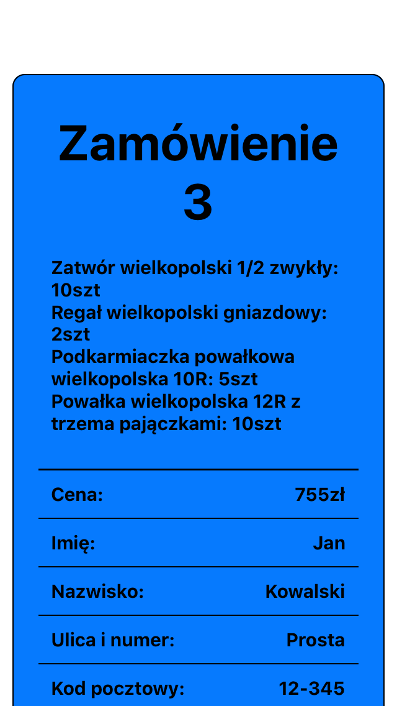
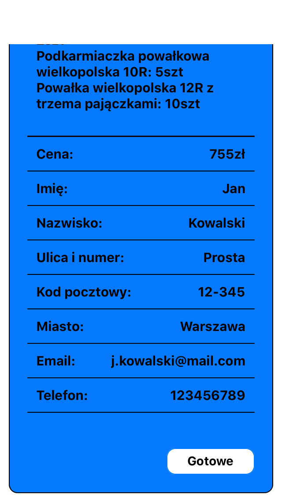

# 📱 Order app on phones 📱 
This application shows orders placed on Wood-products site.

## 💢 Link to app: 💢
Order app uses expo to work, link to project with QR code: https://expo.io/@erykosz/projects/orderApp

## 🔍 Table of contents 🔍
* [General info](#general-info)
* [Technologies](#technologies)
* [Features](#features)
* [Status](#status)
* [Screens](#screens)
* [Inspiration](#inspiration)
* [Contact](#contact)

## 📋 General info 📋
This application fetch data from firebase realtime database. Informations about orders shows up on cards stacked in column.
When products are ready to delivery, you can delete card from database on phone.
The application is written with React Native.

## ⚙️ Technologies ⚙️
* Javascript
* React Native
* Firebase

## 🚀 Features 🚀
* Sorted informations about order
* Realtime refreshing cards

## ⌚️ Status ⌚️
Project is in progress

🔧 To-do list:
* Order history
* Bin to recover orders
* Updating count of produts in magazine by application

## 🖼️ Screens 🖼️

## 🖌 Inspiration 🖌
My dad make a products to his auctions in workshop so it's uncomfortable to check every order on computer, but he always has a phone with him.
I thought that will be a good solution to move a informations about orders to mobile app.

## 📧 Contact 📧
Created by Eryk Ueberhan,
eryk.ueberhan@gmail.com
